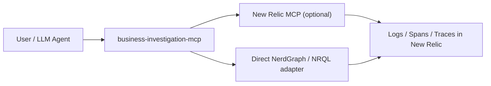
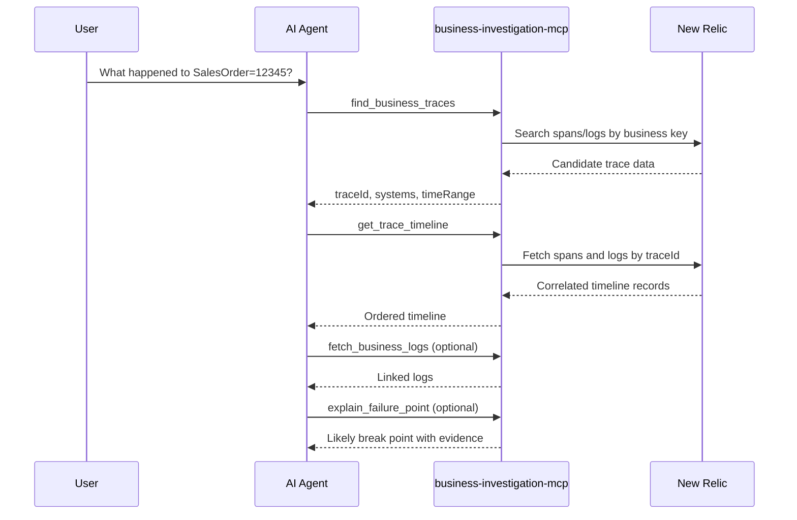

# business-investigation-mcp

A small, public MCP starter that demonstrates a business-semantic investigation layer on top of New Relic.

This repository is designed for enterprise architects and engineers who want to show a customer what a custom MCP layer can look like when the question is not "run a raw query" but "what happened to SalesOrder=12345?"

It is intentionally narrow:

- It exposes 4 business-semantic tools.
- It hides raw observability primitives from the LLM.
- It runs out of the box with generated fake mock data.
- It includes a lightweight, credible New Relic integration path without turning into a generic API wrapper.

## Why this exists

New Relic already gives you observability primitives. The official remote New Relic MCP server also already exposes discovery and data-access tools such as `execute_nrql_query`, `natural_language_to_nrql_query`, `get_entity`, `list_related_entities`, and `list_available_new_relic_accounts`.

This starter is not trying to replace that.

It demonstrates the next layer up:

- map a business key like `SalesOrder=12345` to likely traces
- reconstruct the end-to-end flow across systems
- collect linked logs
- explain the most likely failure point in a stable JSON shape that an LLM can consume directly

That keeps the model focused on business investigation workflows instead of low-level observability mechanics.

## Current New Relic model reflected here

This README reflects the New Relic docs checked on March 20, 2026.

- Prefer [NerdGraph](https://docs.newrelic.com/docs/apis/nerdgraph/get-started/introduction-new-relic-nerdgraph/) as the main direct API surface rather than REST.
- The official [New Relic MCP server](https://docs.newrelic.com/docs/agentic-ai/mcp/overview/) is available remotely over HTTP.
- The official [MCP tool reference](https://docs.newrelic.com/fr/docs/agentic-ai/mcp/tool-reference/) includes discovery and data-access tools such as `execute_nrql_query`, `natural_language_to_nrql_query`, `get_entity`, `list_related_entities`, and `list_available_new_relic_accounts`.
- New Relic MCP supports the `include-tags` HTTP header, which this starter uses to constrain remote access to `discovery,data-access`.
- For direct NerdGraph access, this starter expects a user key via `NEW_RELIC_USER_API_KEY`.
- Least privilege and RBAC matter. Use a dedicated pilot account/user scope, and do not grant broader access than the business investigation workflow actually needs.

## Architecture



The important design choice is that the custom MCP owns the business semantics. New Relic stays behind the adapter boundary.

## Why only 4 tools

This starter exposes exactly these tools:

| Tool | Purpose |
| --- | --- |
| `find_business_traces` | Find likely trace IDs, systems involved, and time range for a business key. |
| `get_trace_timeline` | Reconstruct an ordered end-to-end timeline for a trace from spans and logs. |
| `fetch_business_logs` | Return logs linked directly or indirectly to the business transaction. |
| `explain_failure_point` | Identify the most likely break point with supporting evidence. On successful traces it returns `failureDetected: false` and a no-failure explanation. |

It does **not** expose a raw NRQL tool. That is deliberate. The goal is to keep the LLM working at the business investigation layer.

## Sequence



## Project structure

```text
src/
  backends/
  services/
  tools/
  config.ts
  server.ts
  types.ts
sample-data/
tests/
```

- `MockBackend` is the default and fully working path.
- In mock mode, the server synthesizes fake traces, spans, and logs from the sample templates so you can demo arbitrary business keys without real telemetry.
- `NewRelicBackend` is intentionally lightweight but real.
- `InvestigationService` owns correlation, timeline reconstruction, and failure inference.
- Tool handlers are thin MCP wrappers around that service.

## Quick start

### 1. Install

```bash
npm install
```

### 2. Run in mock mode

```bash
cp .env.example .env
npm run dev
```

The default `.env.example` already uses `BACKEND_MODE=mock`, so no credentials are required.

If you want to protect the MCP endpoint itself, set `MCP_API_KEY`. When configured, `/mcp` accepts either:

- `x-api-key: <your key>`
- `Authorization: Bearer <your key>`

The `/healthz` endpoint remains unauthenticated.

The server starts on:

- MCP endpoint: `http://localhost:3000/mcp`
- Health endpoint: `http://localhost:3000/healthz`

### 3. Connect a local MCP client

This repo includes a sample [`mcp-client-config.json`](./mcp-client-config.json) for a generic HTTP-capable client:

```json
{
  "servers": {
    "business-investigation-mcp": {
      "type": "http",
      "url": "http://localhost:3000/mcp",
      "headers": {
        "x-api-key": "replace-with-mcp-api-key-if-enabled"
      }
    }
  }
}
```

### 4. Run tests and checks

```bash
npm run lint
npm run typecheck
npm test
npm run build
```

## Docker

```bash
docker build -t business-investigation-mcp .
docker run --rm -p 3000:3000 business-investigation-mcp
```

With MCP endpoint protection enabled:

```bash
docker run --rm -p 3000:3000 \
  -e MCP_API_KEY=replace-me \
  business-investigation-mcp
```

## Mock data scenarios

The repo ships with two sample templates under [`sample-data/`](./sample-data):

- Success flow: `SalesOrder=12345`
  - APIM receives the request
  - Solace publishes the message
  - MuleSoft consumes and transforms it
  - ERP receives and processes it successfully
- Failure flow: `SalesOrder=98421`
  - APIM receives the request
  - Solace publishes the message
  - MuleSoft consumes it
  - MuleSoft fails during transformation
  - no ERP continuation appears

In mock mode, the server uses these templates to generate fake traces, logs, and summaries. The seeded `SalesOrder=12345` and `SalesOrder=98421` flows remain stable for tests and demos, and other business keys are synthesized on demand.

## Example outputs

### Successful flow

Example `find_business_traces` result for `SalesOrder=12345`:

```json
{
  "businessKey": {
    "type": "SalesOrder",
    "value": "12345"
  },
  "lookbackMinutes": 120,
  "matches": [
    {
      "traceId": "trace-salesorder-12345",
      "systemsInvolved": ["APIM", "Solace", "MuleSoft", "ERP"],
      "timeRange": {
        "start": "2026-03-18T09:00:00.000Z",
        "end": "2026-03-18T09:00:08.450Z"
      },
      "confidence": 0.99,
      "summary": "Sales order 12345 moved from APIM to ERP and completed successfully."
    }
  ],
  "summary": "Found 1 candidate trace(s) for SalesOrder=12345."
}
```

Example `get_trace_timeline` result for `trace-salesorder-12345`:

```json
{
  "traceId": "trace-salesorder-12345",
  "systemsInvolved": ["APIM", "Solace", "MuleSoft", "ERP"],
  "timeline": [
    {
      "timestamp": "2026-03-18T09:00:00.000Z",
      "service": "APIM",
      "eventType": "span",
      "message": "POST /sales-orders completed."
    },
    {
      "timestamp": "2026-03-18T09:00:01.100Z",
      "service": "Solace",
      "eventType": "span",
      "message": "Publish sales-order.created completed."
    },
    {
      "timestamp": "2026-03-18T09:00:04.100Z",
      "service": "MuleSoft",
      "eventType": "span",
      "message": "Transform sales order payload completed."
    },
    {
      "timestamp": "2026-03-18T09:00:07.000Z",
      "service": "ERP",
      "eventType": "span",
      "message": "Create ERP sales order completed."
    }
  ],
  "summary": "Trace trace-salesorder-12345 reaches APIM -> Solace -> MuleSoft -> ERP and completes successfully."
}
```

### Failed flow

Example `explain_failure_point` result for `SalesOrder=98421`:

```json
{
  "businessKey": {
    "type": "SalesOrder",
    "value": "98421"
  },
  "traceId": "trace-salesorder-98421",
  "failureDetected": true,
  "likelyFailurePoint": {
    "service": "MuleSoft",
    "reason": "Transformation failed for SalesOrder=98421 because customerCode was missing. Transform sales order payload recorded an error span. No downstream ERP span appears after MuleSoft.",
    "lastSuccessfulStep": "MuleSoft: Consume sales-order.created",
    "missingExpectedService": "ERP",
    "supportingLogIds": ["log-mule-98421-2"],
    "confidence": 0.96
  },
  "confidence": 0.96,
  "summary": "The most likely failure point for SalesOrder=98421 is MuleSoft."
}
```

Example `fetch_business_logs` result for `SalesOrder=98421`:

```json
{
  "businessKey": {
    "type": "SalesOrder",
    "value": "98421"
  },
  "traceIds": ["trace-salesorder-98421"],
  "logs": [
    {
      "service": "APIM",
      "severity": "info",
      "message": "Received SalesOrder=98421 request and started order intake flow."
    },
    {
      "service": "MuleSoft",
      "severity": "error",
      "message": "Transformation failed for SalesOrder=98421 because customerCode was missing."
    }
  ],
  "summary": "Collected 5 log(s) related to SalesOrder=98421."
}
```

## Configuration

### Required variables supported by this starter

| Variable | Default | Notes |
| --- | --- | --- |
| `BACKEND_MODE` | `mock` | `mock` or `newrelic` |
| `MCP_API_KEY` | empty | Optional API key that protects the `/mcp` endpoint |
| `NEW_RELIC_REGION` | `US` | `US` or `EU` |
| `NEW_RELIC_USER_API_KEY` | empty | Required for `newrelic` mode |
| `NEW_RELIC_ACCOUNT_ID` | empty | Required for `newrelic` mode |
| `NEW_RELIC_MCP_URL` | Region default | `https://mcp.newrelic.com/mcp/` or `https://mcp.eu.newrelic.com/mcp/` |
| `NEW_RELIC_INCLUDE_TAGS` | `discovery,data-access` | Restricts remote MCP tool access |
| `DEFAULT_LOOKBACK_MINUTES` | `120` | Default lookback window |

### Additional optional variable

| Variable | Default | Notes |
| --- | --- | --- |
| `BUSINESS_KEY_FIELD_CANDIDATES` | `salesOrder,orderId,businessKey,correlationId,message` | Generic field candidates used by the live adapter |
| `PORT` | `3000` | Operational convenience only |

## Switching to New Relic mode

Set:

```bash
BACKEND_MODE=newrelic
NEW_RELIC_REGION=US
NEW_RELIC_USER_API_KEY=YOUR_USER_KEY
NEW_RELIC_ACCOUNT_ID=YOUR_ACCOUNT_ID
NEW_RELIC_MCP_URL=https://mcp.newrelic.com/mcp/
NEW_RELIC_INCLUDE_TAGS=discovery,data-access
BUSINESS_KEY_FIELD_CANDIDATES=orderId,salesOrder,businessKey,correlationId,message
```

How the live path works:

- Direct NerdGraph is the primary live integration path.
- The live adapter queries `Span` and `Log` data via NRQL through NerdGraph.
- The adapter can also initialize a client to the official New Relic MCP server using the `include-tags` header, currently to validate discovery access without exposing the full remote toolset to the calling LLM.
- The business-semantic logic still runs locally in this repo.

This keeps the architecture aligned to the current New Relic model while still keeping the starter easy to understand.

## Least privilege and RBAC guidance

- Use a dedicated pilot user key, not a shared admin credential.
- Scope the pilot to the smallest set of New Relic accounts and entities needed.
- Restrict remote MCP access with `NEW_RELIC_INCLUDE_TAGS=discovery,data-access`.
- Start with a non-production or lower-risk environment first.
- Treat the official remote MCP integration as preview functionality and validate compliance fit before broader rollout.
- Never commit real account IDs, customer field mappings, or secrets into this repository.

More detail is in [`SECURITY.md`](./SECURITY.md).

## How this pattern extends beyond observability

The same pattern can sit above other enterprise systems:

- ERP or OMS lookups
- CRM enrichment
- message broker metadata
- ticketing systems
- master data or reference services

The custom MCP remains the business-facing layer. Each underlying platform stays behind a narrow adapter.

## Pilot success criteria

A practical pilot can be considered successful if the team can:

- answer the 4 core questions for representative transactions in a few tool calls
- cut mean time to understand an order-flow issue from manual dashboard hopping to a single guided investigation
- produce stable, LLM-friendly JSON for both success and failure scenarios
- swap the mock backend for a customer-specific live backend with limited code changes
- demonstrate least-privilege access rather than giving the model broad observability control

## What is intentionally simplified

- Mock mode generates fake demo data from local templates. It is suitable for demos and agent workflow development, not for validating real incidents.
- The live adapter is generic, not customer-specific. Real teams should tune `BUSINESS_KEY_FIELD_CANDIDATES` and the correlation rules to match their telemetry.
- The optional remote MCP usage is intentionally lightweight. This starter shows where discovery/data-access calls fit but does not try to mirror the entire official New Relic MCP surface.
- Failure inference is heuristic by design: error logs, failed spans, and missing downstream continuation are combined into a clear explanation rather than a perfect causal model.
- No raw NRQL tool is exposed publicly in this starter.

## Companion docs

- [`ARCHITECTURE.md`](./ARCHITECTURE.md)
- [`OBSERVABILITY_AGENT.md`](./OBSERVABILITY_AGENT.md)
- [`SECURITY.md`](./SECURITY.md)
- [`mcp-client-config.json`](./mcp-client-config.json)

## License

[Apache-2.0](./LICENSE)
